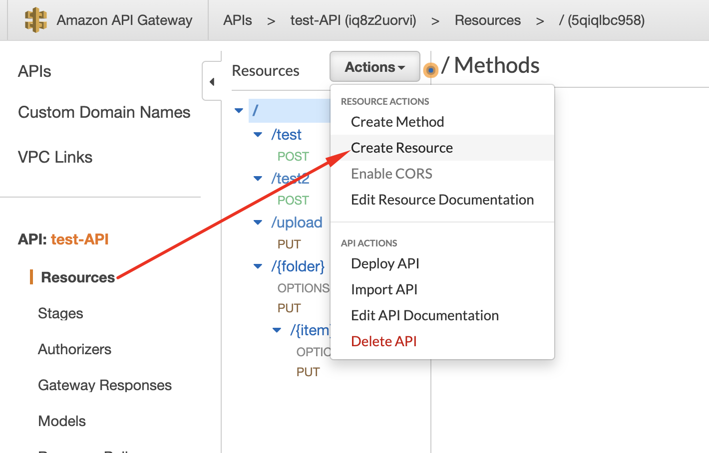

# HTTPS

It is possible to send video clips from an AXIS device via HTTPS to AWS S3:


# Environment
- AXIS Device:  9.25.1.5 firmware on AXIS P7304 Video Encoder
- We used this stream profile:


# AWS setup

## API Gateway Setup 
Step 1: Goto API Gateway, create new gateway, then click into Setting of that gateway:


Step 2: Add Binary Media Types `video/x-matroska` to support mkv file type. Then click `Save Changes` button.


Step 3: Click `Resources` menu. Then click `Actions>Create` Resource.



Step 4: In New Child Resource window, set Resource Name and Resource Path is upload. Then click Create Resource button to create resource.


Step 5: Create new PUT or POST method in the resource:


## API Gateway -> Lambda -> S3 Setup

Step 1: Setting Method Execution


Step2: Add mapping template for mkv file type whereby the content of the mapping template can be found [here](./API_gateway_to_lambda_to_S3/content_mapping_template.txt).


## Lambda Handler

The lambda handler code we used can be found at 


# Axis Device Recipient Configuration

```
Name: <free choice of name>
Type: HTTPS
URL: Can be found under API Gateway > Stages > stage dropdown > endpoint name  > POST > "Invoke URL"
Validate server certificate: <True or False depending on your needs>
Username: <empty>
Password: <empty>
```

# Results

API gateway has a payload size limit of 10MB. 

- 1m post-buffer duration and 1m recurring event - rejected by API gateway for being too large payloads 

- 45s post-buffer duration and 45s recurring event- rejected by API gateway for being too large payload

- 15s post-buffer duration and 15s recurring event: this created clips but occasional dropped clips due to mysterious 
- 
```
GDBus.Error:com.axis.Streamer.Buffer.Error.Retry: Request can not be serviced at this time, retry the operation”
```
error in the AXIS device's system log.

**We concluded this was not a reliable way to stream video to the cloud.**
